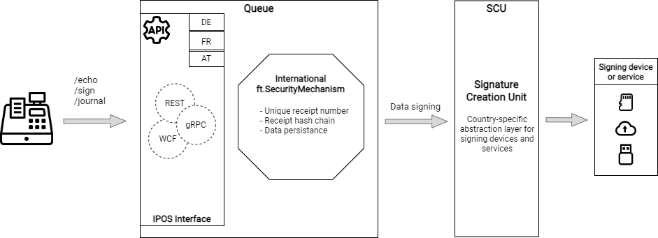

# fiskaltrust.Middleware
    

The fiskaltrust.Middleware is an integrated set of highly configurable software components for POS systems to abstract the complexity of national fiscalization laws.

## Introduction
National fiscalization laws highly differ between most countries, and are often very complex to understand and implement. The fiskaltrust.Middleware abstracts this complexity behind a common international interface, so that creators of POS software can focus on their core business and features.

The Middleware itself is free, and part of a bigger ecosystem and platform that includes features for automated rollouts and maintenance, user onboarding, and much more. On top of this, the Middleware can be used with fiskaltrust's optional add-on products for revision-safe storage and 3rd party integrations.

### Features
- Currently available in Austria, Germany, France and Italy (with more to come!)
- International interface - implement once, use everywhere
- Detailed documentation of national requirements (in English)
- Free to use in all supported countries
- Integration of all relevant signing devices and services (e.g. TSEs in Germany, smart cards & online services in Austria, ...)
- Seamless integration into fiskaltrust's cloud platform for updates, maintenance and monitoring
- Automatic compatibility with revisionsafe storage add-ons for 100% compliance to national regulations

### Getting started
If you're a PosCreator (i.e. a software developer who's creating POS software and wants to implement the Middleware), please have a look into our [getting started guide for PosCreators](https://docs.fiskaltrust.cloud/docs/poscreators/get-started) first. 

If you're a PosDealer - and thus interested in rolling out the Middleware to your end customers -, please check our [getting started guide for PosDealers](https://docs.fiskaltrust.cloud/docs/posdealers/get-started).

## Architecture and repository structure
The Middleware is highly configurable by combining different **packages** into a **CashBox** configuration container. These packages are then either hosted on-prem by the platform-independent [fiskaltrust.Launcher](https://github.com/fiskaltrust/middleware-launcher) application, or in the cloud (either by yourself or by fiskaltrust).

There are three categories of packages:
1. **Queue packages** contain the international _fiskaltrust.SecurityMechanism_, the data persistance layer, and the logic that transforms international requests into country-specific ones to forward them to the _Signature Creation Unit_. The same Queue packages can be used in each market; generally, there's one package per database type (e.g. MySQL, SQLite, EF/SQL Server, ...).
2. **Signature Creation Unit packages** are abstractions of local signing devices or services, and therefore country-specific. These packages are used to "normalize" the different interfaces of these external devices or services, so that they can be used by the Queue. Usually, there's a separate package for each supported signing device/service (e.g. one SCU package per TSE in Germany).
3. **Helper packages** are packages to take care of additional tasks, e.g. uploading data to the fiskaltrust cloud services.

## Documentation & release notes
Documentation and release notes are maintained on GitHub (look for the `-doc` postfix in our repositories), and available on [docs.fiskaltrust.cloud](https://docs.fiskaltrust.cloud).

## Contributing
In general, we welcome all kinds of contributions and feedback, e.g. via [issues](./issues) or [pull requests](./pulls), and want to thank every future contributors in advance!

Please check out the [contribution guidelines](./CONTRIBUTING.md) for more detailed information about how to proceed.

## Debugging using the Test Launcher

For development purposes the `queue/fiskaltrust.Middleware.sln` solution and SCU market solutions (e.g. `scu-it/fiskaltrust.Middleware.SCU.IT.sln`) contain TestLauncher projects ([`queue/test/Manual/fiskaltrust.Middleware.Queue.Test.Launcher/Program.cs`](queue/test/Manual/fiskaltrust.Middleware.Queue.Test.Launcher/Program.cs), [`scu-it/test/TestLauncher/Program.cs`](scu-it/test/TestLauncher/Program.cs)).

To run a queue or scu using the test launcher you need to configure a sandbox cashbox and set the cashboxId and accessToken (and localization for a queue) in the `Program.cs` file of the TestLauncher.

You can start a debugging session from VisualStudio or VisualStudio Code and debug the launcher there.
Or you can then start the TestLauncher on the commandline like so: `dotnet run --project queue\test\Manual\fiskaltrust.Middleware.Queue.Test.Launcher\fiskaltrust.Middleware.Queue.Test.Launcher.csproj`.

> ***Note:** You may need to start the TestLauncher as an administrator or windows does not allow the ports to be bound. For that you need to start VisualStudio as an administrator.*

## License
The fiskaltrust Middleware is released under the [EUPL 1.2](./LICENSE). 

As a Compliance-as-a-Service provider, the security and authenticity of the products installed on our users' endpoints is essential to us. To ensure that only peer-reviewed binaries are distributed by maintainers, fiskaltrust explicitly reserves the sole right to use the brand name "fiskaltrust Middleware" (and the brand names of related products and services) for the software provided here as open source - regardless of the spelling or abbreviation, as long as conclusions can be drawn about the original product name.  

The fiskaltrust Middleware (and related products and services) as contained in these repositories may therefore only be used in the form of binaries signed by fiskaltrust. 
