- Feature Name: `release_lifecycle`
- Start Date: 2025-05-08
- RFC PR: [fiskaltrust/middleware#441](https://github.com/fiskaltrust/middleware/pull/441)
- Tracking Issue: [fiskaltrust/engineering#777](https://github.com/fiskaltrust/engineering/issues/777)

# Summary

This RFC proposes to change the middleware release process from developers pushing release out to the market teams pulling them in.  
This is done by splitting it into two phases.
First, the **deployment phase** handled by the developers where the middleware is built and deployed to the servers but not yet publicly available.  
And second, the **release phase** handled by the market teams where the release visibility is managed and the release is made public.

# Motivation

The current release process is lacking a few things which this RFC aims to solve.

* The possibility to End2End test a release before it being made public.
* The possibility to release something for internal testing that should not be made public.
* The possibility to release versions certain customers only.
* The possibility of prerelease versions that are not automatically used in production.
* The possibility for the market teams to greenlight releases.
* The possibility for broken releases to be "unreleased".

# Guide-level explanation

The middleware release process is split up into two main phases.

1. Deployment
2. Release

The **deployment phase** is performed in the middleware github repository using issues, milestones, releases, actions, etc.  
At the end of the deployment phase all middleware artifacts that are to be released are deployed to the respective targets.
(This includes nuget and zip packages, the release notes documents, etc..)  
Most of the artifacts are not yet listed or downloadable anywhere.   
The middleware development team is responsible for handling this part of the release process.

The **release phase** is performed in the portal admin interface.  
It's purpose is to manage the publishing (releasing) of the artifacts that were deployed in the previous phase.  
At the beginning of this phase the release (collection of artifacts related to a middleware version) is deployed on the servers but unlisted and not downloadable.  
In the admin release console in the portal the release can be reviewed, approved, and published.  
A release can have complex visibility states for different environments (sandbox, production and the different markets).  
A staggered rollout and rollbacks are possible.  
At the end of the release phase the artifacts are listed and downloadable on all servers.  
The customer success teams are responsible for handling this part of the release process.

## Deployment Phase

### Versioning Scheme

The middleware versions use [SemVer v1](https://semver.org/spec/v1.0.0.html) for it's version structure conventions and a modified version of [0ver](https://0ver.org) (called "1ver") for it's semantic conventions.

Two prerelease identifiers are allowed:
| identifier | description                                                                                          | environments        |
|------------|------------------------------------------------------------------------------------------------------|---------------------|
| `-ciX`     | "continuous integration" is used for dev releases used for internal testing of features.             | sandbox             |
| `-rcX`     | "release candidate" are used for testing of whole releases and external testing as well as hotfixes. | production, sandbox |

### Artifacts

| artifact         | target                             | notes                                                                             | published in this stage                                                                                    |
|------------------|------------------------------------|-----------------------------------------------------------------------------------|------------------------------------------------------------------------------------------------------------|
| github tag       | middleware github repo             | Every released version has a tag that can be used to link the version to a commit | ✅                                                                                                          |
| github release   | middleware github repo             | This contains the autogenerated github release notes for this package             | ✅                                                                                                          |
| release notes    | release notes repository           |                                                                                   | ✅ (With a disclaimer that the version will become available soon)                                          |
| byodc            | github container registry          |                                                                                   | ✅                                                                                                          |
| cloudcashbox     | cloudcashbox instances             |                                                                                   | ❌ (The cloudcashbox does not support the release phase it is relased manually by the development team)     |
| android launcher | google play store                  |                                                                                   | ❌ (The android launcher does not support the release phase it is relased manually by the development team) |
| nuget package    | public devops nuget feed/nuget.org |                                                                                   | ❌                                                                                                          |
| nuget package    | sandbox packages v1 server         |                                                                                   | ❌                                                                                                          |
| nuget package    | production packages v1 server      |                                                                                   | ❌                                                                                                          |
| zip package      | sandbox packages v2 server         |                                                                                   | ❌                                                                                                          |

## Release Phase

### States

The following states describe the lifecycle of a release within the portal release console.

| State     | Direction | Description                                             |
|-----------|-----------|---------------------------------------------------------|
| Unlisted  | ⬇️        | Artifacts are deployed and downloadable but not listed. |
| Published | ↕️        | Artifacts are deployed, listed, and downloadable.       |
| Yanked    | ⏹️        | Artifacts are deployed and downloadable but not listed. |

An _Unlisted_ release can be set to _Published_ or _Yanked_.  
A _Published_ release can be set to _Unlisted_ or _Yanked_.  
The state of a _Yanked_ release can not be changed anymore.

### Environments

The release state is managed separately for sandbox and production.  
In sandbox the default state is _Published_.  
In production the default state is _Unlisted_.

A release can be overwritten to _Published_ for specific markets or accounts.  
A release can only be _Yanked_ everywhere at once.

### Prerelease Versions

PreRelease versions only visible if you have checked the "Show prereleases" checkmark in the portal version selection interface.  
They are not selected by default when creating new component in the portal and they are not used by automatic processes such as templates.

### Version Tracability

Every deployed version has a related tag in the middleware repository.  
Every public version should have a release notes post at `https://docs.fiskaltrust.cloud/changelog/middleware/<version>`.

When showing the version of a package we can link directly to the github repository or release notes of said release.

### Admins

Admins have access to the Release Console in the portal where the release states can be managed.  
The release state of all packages is overwritten to _Published_ for all admin accounts.

### Release Console

The Release Console is reachable through the market production portals. (Because sandbox releases are always _Public_ by default there's no need to manage those separately)  
There's no separate for the different markets but the same console with the same state that's loaded in all markets.

In the Release Console a table lists all deployed versions with their states in production as well as overrides and possibility to yank a release.

The releases are grouped by version in the table.
The release can be published for whole group or separatley for for single packages (when it's not the same for all packages a `-` is shown in the group checkbox).  
Overrides for markets and accounts can be set.
The release can be yanked through a separate confirmation dialog. It's then yanked in sandbox _and_ production.

(this is just a ui mockup to demonstrate the functionality ux and layout will be designed properly when implementing the RFC)

# Reference-level explanation

## Deployment Process

The process of the **deployment phase** is described in [`RELEASE.md`](../README.md).

## Storage

## API

## Release Console

## Packages Servers

> This is the technical portion of the RFC.
> Try to capture the broad implementation strategy,
> and then focus in on the tricky details so that:
> 
> - Its interaction with other features is clear.
> - It is reasonably clear how the feature would be implemented.
> - Corner cases are dissected by example.
> - Discuss how this impacts the ability to read, understand, and maintain middleware code.
>   Code is read and modified far more often than written; will the proposed feature make code easier to maintain?
> 
> When necessary, this section should return to the examples given in the previous section and explain the implementation details that make them work.
> 
> When writing this section be mindful of the following:
> - **RFCs should be scoped:** Try to avoid creating RFCs for huge design spaces that span many features.
>   Try to pick a specific feature slice and describe it in as much detail as possible.
>   Feel free to create multiple RFCs if you need multiple features.
> - **RFCs should avoid ambiguity:** Two developers implementing the same RFC should come up with nearly identical implementations.
> - **RFCs should be "implementable":** Merged RFCs should only depend on features from other merged RFCs and existing features.
>   It is ok to create multiple dependent RFCs, but they should either be merged at the same time or have a clear merge order that ensures the "implementable" rule is respected.

# Drawbacks

The Relese Console increases the complexity of the release process and the number of people wo need to get involved.

This increases the error surface of the packages servers.

> Why should we *not* do this?

# Rationale and alternatives

> - Why is this design the best in the space of possible designs?
> - What other designs have been considered and what is the rationale for not choosing them?
> - What objections immediately spring to mind? How have you addressed them?
> - What is the impact of not doing this?

# Unresolved questions

> - What parts of the design do you expect to resolve through the RFC process before this gets merged?
> - What parts of the design do you expect to resolve through the implementation of this feature before before the feature PR is merged?
> - What related issues do you consider out of scope for this RFC that could be addressed in the future independently of the solution that comes out of this RFC?

# \[Optional\] Future possibilities

## Versioning Scheme

TODO: Check where 1.3 version stuff is hardcoded.

> Think about what the natural extension and evolution of your proposal would be and how it would affect the middleware and ecosystem as a whole in a holistic way.
> Try to use this section as a tool to more fully consider all possible interactions with the project in your proposal.
> Also consider how this all fits into the roadmap for the project and of the relevant sub-team.
> 
> This is also a good place to "dump ideas", if they are out of scope for the RFC you are writing but otherwise related.
> 
> Note that having something written down in the future-possibilities section is not a reason to accept the current or a future RFC;
> such notes should be in the section on motivation or rationale in this or subsequent RFCs.
> The section merely provides additional information.
