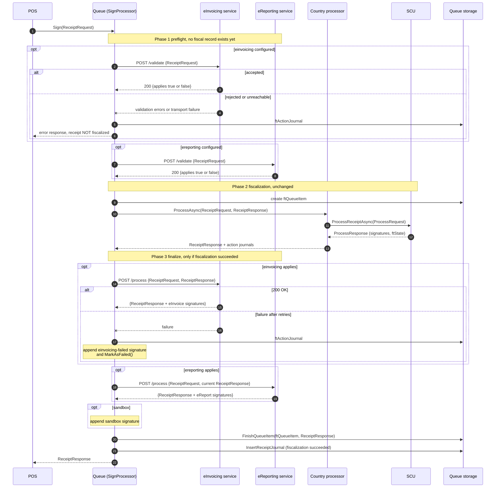

- Feature Name: `queue_einvoicing_ereporting`
- Start Date: 2026-07-13
- RFC PR: [fiskaltrust/middleware#712](https://github.com/fiskaltrust/middleware/pull/712)
<!-- - Tracking Issue: [fiskaltrust/middleware#0000](https://github.com/fiskaltrust/middleware/issues/0000) -->
- Markets: `ES`, `GR`, `PT` (all markets on the v2 shared localization; `IT` and further markets once they are onboarded to the v2 integration). `DE`, `AT` and `FR` are covered by a backport to the legacy stack — see "Backporting to the legacy stack".

# Summary

We introduce an opt-in, queue-level mechanism that allows a Queue to perform **eInvoicing** and **eReporting** steps as part of receipt processing.

The mechanism is a **two-phase call** against an HTTP endpoint configured on queue level:

1. a **preflight** call before fiscalization, which validates the receipt and tells the queue whether the service acts on it at all,
2. a **finalize** call after fiscalization, which receives the fully fiscalized receipt and returns additional signatures.

Splitting the call in two is what makes the failure story sound. Everything a service can predictably reject — missing customer data, an unsupported document type, a receipt it does not handle — is rejected *before* the SCU creates a fiscal record, so the receipt fails cleanly and the POS can simply correct and resend. A failure in either phase fails the receipt.

The middleware ships its own small HTTP client for this. It does not go through the `IClientFactory`/`ClientConfiguration` infrastructure used for SCUs.

# Motivation

Fiscal regulation across our markets is expanding from *fiscalization of the single receipt* towards *transmission of invoices and transactional data to authorities and business recipients*:

- **eInvoicing**: creating structured invoices in a mandated format (e.g. PEPPOL BIS, Factur-X, national formats). The transmission of such invoices to the recipient (eDelivery) is a separate concern and not covered by this RFC.
- **eReporting**: transmitting transactional data to a tax authority *beyond* the fiscalization itself (e.g. digital reporting requirements such as ViDA).

These obligations are distinct from CTC (continuous transaction control) fiscalization: where the middleware already transmits data to an authority today (GR myDATA, ES VeriFactu), that transmission *is* the fiscalization — it creates the fiscal proof for the receipt and therefore correctly lives in the SCU. eInvoicing and eReporting as defined here are *additional* obligations on top of the fiscalized receipt, and the v2 middleware has no place for them today:

- PosCreators who need eInvoicing or eReporting on top of fiscalization have no integration point in the middleware and must build it themselves — losing the queue-generated fields (`ftQueueItemID`, `ftReceiptIdentification`, SCU signatures, QR codes) that the invoice or report must reference.
- New mandates (and markets without an SCU-style fiscalization at all) would each force another ad-hoc solution.

The expected outcome is a single, market-agnostic extension point in the shared localization: a Queue can be configured to call one eInvoicing and/or one eReporting service around fiscalization, and the services can enrich the `ReceiptResponse` with additional signatures and state data.

# Guide-level explanation

## New concepts

- **eInvoicing service**: an HTTP service that validates a receipt before fiscalization and, afterwards, receives the fully fiscalized receipt and creates a structured invoice. It typically returns additional signatures (e.g. a document id, a validation URL, or a QR code pointing to the invoice).
- **eReporting service**: an HTTP service with the same contract that transmits transactional data to an authority.
- **Preflight**: the validation call, made before the country-specific processing and the SCU call.
- **Finalize**: the call made after fiscalization, before the response is persisted and returned to the POS.

Both services are **opt-in**. A queue that doesn't configure them behaves exactly as today.

### Synchronous vs. asynchronous reporting

Reporting obligations come in two fundamentally different flavors, and this RFC only covers one of them:

- **Synchronous reporting** is bound to a single receipt: it runs while the receipt is processed, and its results (signatures, state data) are embedded in the `ReceiptResponse` handed back to the POS. This is what the mechanism in this RFC provides.
- **Asynchronous reporting** is bound to a schedule, not to a single receipt: batch/periodic obligations (e.g. SAF-T-style exports or monthly submissions) that run at configured times over already-processed data. This is *not* covered by the per-receipt mechanism in this RFC; it will be handled via a scheduled mechanism in a separate effort.

## How a PosCreator experiences it

Nothing changes in how receipts are sent: the POS sends the same `ReceiptRequest` to the same sign endpoint. If the queue is configured for eInvoicing and/or eReporting, the returned `ReceiptResponse` contains additional entries in `ftSignatures` (and potentially additional data in `ftStateData`), the same way an SCU adds its signatures.

What is new is that a receipt can now be **rejected before it is fiscalized**, because a configured service declined it. The POS sees a normal error response with a signature naming the reason, and no fiscal record was created. This is the same experience as a validation error raised by the queue itself today, and it is recovered the same way: fix the receipt and send it again.

Which receipts are affected depends on the concern:

- **eInvoicing** only applies to the invoice receipt cases (`B2C`, `B2B`, `B2G`).
- **eReporting** is market-dependent: depending on the regulation it may act on daily operations (daily, monthly, or yearly closing), on specific document types, or on other receipt cases entirely.

The queue drives the flow. Each service reports in its preflight response whether it acts on the receipt at all, and the queue skips the finalize call for a service that does not. Services must answer this consistently, across markets and providers, so the queue can rely on it; the queue does not maintain a receipt-case allowlist of its own.

Example: a queue in Greece configured with an eInvoicing service. The response to a `PointOfSaleReceipt` contains the myDATA signatures created by the SCU (invoice MARK, authentication code, QR URL) *plus* signatures added by the eInvoicing service, e.g.:

```json
{
  "ftSignatures": [
    { "Caption": "invoiceMark", "Data": "400001924190871", "...": "..." },
    { "Caption": "einvoice-id", "Data": "urn:peppol:...:5f9a...", "...": "..." },
    { "Caption": "einvoice-url", "Data": "https://einvoicing.example.com/invoices/5f9a...", "...": "..." }
  ]
}
```

## Configuration

The services are configured in the queue's configuration (the `Configuration` dictionary of the queue's `PackageConfiguration`), following the naming style of the existing `scu-timeout-ms` / `scu-max-retries` keys:

```json
{
  "einvoicing": {
    "endpoint": "https://einvoicing.example.com/v2",
    "timeout-ms": 15000,
    "max-retries": 1
  },
  "ereporting": {
    "endpoint": "https://ereporting.example.com/v2",
    "timeout-ms": 15000,
    "max-retries": 1
  }
}
```

- All configuration keys are lowercase (`einvoicing`, `ereporting`, `endpoint`, …), consistent with the existing lowercase/kebab-case queue configuration keys.
- Presence of a section enables the respective service; absence (the default) disables it. Each section supports exactly one endpoint.
- `timeout-ms` is **per attempt** and defaults to 15000. `max-retries` is the number of **additional** attempts after the first and defaults to 1, so out of the box each call is at most two attempts of at most 15s.
- Authentication is not configured per service. Every call carries the cashbox identity as headers, taken from the queue's own configuration — see "HTTP wire protocol".

## Processing order and failure behavior

1. **Preflight.** Before any bookkeeping that produces a fiscal record, the queue calls the configured services in order (eInvoicing, then eReporting) with the `ReceiptRequest`. Each service answers whether the receipt is valid for it, and whether it acts on this receipt at all.
2. If a preflight call **rejects** the receipt, or **fails** (unreachable, timeout, non-2xx after retries), processing stops. The receipt is **not fiscalized**, the queue returns an error response naming the reason, and an action journal entry is written. No fiscal record and no receipt journal entry exist.
3. **Fiscalization.** If every preflight passed, the receipt is processed as today: queue bookkeeping, country-specific command processor, SCU call. If fiscalization itself fails, behavior is unchanged and the finalize calls are skipped.
4. **Finalize.** For each service that said it acts on this receipt, the queue calls it with the *current* `ReceiptRequest`/`ReceiptResponse` pair, in the same order. The eReporting service therefore sees what the eInvoicing service added.
5. On success the returned signatures are merged into the response. On failure the receipt is **marked as failed** (`ftState` = `0xEEEE_EEEE`, the same error state the middleware uses for every other failure), with a failure signature naming the service and an action journal entry carrying the technical detail.

> ***Note:*** step 5 is the one place where a failure occurs *after* the SCU created a fiscal record. The preflight exists to make that case rare rather than routine: everything a service can decide from the request alone is decided in step 1, so a finalize failure is a genuine transport or service fault, not a validation outcome. It is not eliminated — see "Error and failure handling".

## Latency

The calls are synchronous and happen inside the queue's sequential processing (one receipt at a time per queue). A fully configured queue adds up to four HTTP calls to a receipt: two preflights and two finalizes. Preflight calls are cheap by design — no fiscal work has happened yet and the service only validates — but they sit on the critical path like everything else. PosCreators should size `timeout-ms` accordingly.

# Reference-level explanation

## End-to-end sequence

The diagram shows one receipt with both services configured and both acting on it. Phase 2 is today's behavior, unchanged. Phases 1 and 3 are new.



Two points the diagram makes explicit:

- A preflight rejection returns before the queue item is created. Nothing is fiscalized, nothing is journaled, and the POS is free to correct the receipt and send it again as a new transaction.
- The receipt journal decision is based on the **fiscalization** outcome, not on the final `ftState`. A finalize failure still produces a journaled, fiscalized receipt that happens to carry an error state.

## Interfaces

We add two market-agnostic interfaces to the `fiskaltrust.interface` package (namespace `fiskaltrust.ifPOS.v2`):

```cs
namespace fiskaltrust.ifPOS.v2;

public class ValidateRequest
{
    public required ReceiptRequest ReceiptRequest { get; set; }
}

public class ValidateResponse
{
    /// <summary>Whether this service acts on this receipt at all. If false, the finalize call is skipped.</summary>
    public required bool Applies { get; set; }

    /// <summary>Empty when the receipt is accepted. Any entry rejects the receipt before fiscalization.</summary>
    public List<string> Errors { get; set; } = [];
}

public class ProcessRequest
{
    public required ReceiptRequest ReceiptRequest { get; set; }
    public required ReceiptResponse ReceiptResponse { get; set; }
}

public class ProcessResponse
{
    public required ReceiptResponse ReceiptResponse { get; set; }
}

public interface IEInvoicingService
{
    Task<ValidateResponse> ValidateReceiptAsync(ValidateRequest request);
    Task<ProcessResponse> ProcessReceiptAsync(ProcessRequest request);
}

public interface IEReportingService
{
    Task<ValidateResponse> ValidateReceiptAsync(ValidateRequest request);
    Task<ProcessResponse> ProcessReceiptAsync(ProcessRequest request);
}
```

- The `ProcessRequest`/`ProcessResponse` shape is deliberately identical to the market SCU contracts, but defined once in the market-agnostic `fiskaltrust.ifPOS.v2` namespace (the existing per-market types remain untouched).
- Two distinct interfaces rather than one shared interface keep the two concerns separately addressable in wiring, and leave room for the contracts to diverge later without a breaking change.
- `Applies` is what removes the receipt-case allowlist from the queue. A service that does not handle a given `ftReceiptCase` answers `Applies = false` and is not called again for that receipt.
- `Errors` is deliberately a flat list of strings for now. eInvoicing has many specific validation failures that will need structured handling; that is a known follow-up (see "Unresolved questions"), and the shape here is the minimum that lets the queue reject with a reason.
- This requires a new `fiskaltrust.interface` version (current reference: `1.3.78-rc1`).

### Contract for implementations

On **validate**, an implementation receives the `ReceiptRequest` only; no fiscal data exists yet. It **must not** have side effects: the queue may abandon the receipt afterwards for unrelated reasons, and no finalize call is guaranteed to follow.

On **process**, an implementation receives the full `ReceiptResponse` **including all fields generated by the Queue and the SCU** (`ftSignatures`, `ftState`, `ftStateData`, `ftReceiptIdentification`, `ftQueueItemID`, …) and returns the `ReceiptResponse` to be used from then on. Implementations:

- **may** append `SignatureItem`s to `ftSignatures`,
- **may** add data to `ftStateData` — and **must merge** into the existing structure (`MiddlewareStateData`), never replace it,
- **may** set an error `ftState` on the returned response to signal that the finalize step failed. This is handled exactly like a non-2xx response (see "Error and failure handling"); the two channels exist for convenience, not because they mean different things,
- **must not** remove or alter existing signatures, and **must not** change the identifying fields (`ftQueueItemID`, `ftQueueID`, `ftCashBoxID`, `cbReceiptReference`, `ftReceiptIdentification`, `ftReceiptMoment`),
- **must** be idempotent per `ftQueueItemID`: due to retries the same `ProcessRequest` can arrive more than once, and must not create a duplicate invoice or report.

Anything a service can decide from the request alone belongs in the preflight, where a rejection is safe. A failure signalled at finalize, by whichever channel, is a failure after fiscalization.

The middleware treats the returned response as authoritative but logs a warning and writes an action journal entry if a returned response dropped previously present signatures, so a misbehaving service is diagnosable after the fact.

## HTTP wire protocol

The middleware ships **its own HTTP client** for this, in `fiskaltrust.Middleware.Localization.v2`. It does not use `IClientFactory<T>`/`ClientConfiguration`; see "Rationale and alternatives" for why.

- `POST {endpoint}/validate` with a `ValidateRequest` body, and `POST {endpoint}/process` with a `ProcessRequest` body.
- Bodies are serialized with `System.Text.Json` using the same options as the sign endpoint (`UnsafeRelaxedJsonEscaping`), `Content-Type: application/json`.
- Every request carries `x-cashbox-id` and `x-cashbox-accesstoken`, matching the header names the SCU HTTP clients already use. The hosting environment injects `cashboxid` and `accesstoken` into every queue's configuration dictionary, so both values are taken from there and can be assumed present. The receiving service authenticates the caller against them.
- Response `200 OK` with a well-formed body means success. Any other status code, a malformed body, or a timeout is a failure. There are no partial successes.
- **Timeout**: `timeout-ms` bounds each individual attempt and is enforced by passing a `CancellationToken` to `HttpClient.SendAsync`, so the in-flight request is actually cancelled rather than merely abandoned.
- **Retries**: up to `max-retries` *additional* attempts, on timeout and 5xx only. A 4xx, or a `200` whose body carries an error `ftState`, is never retried: both are deliberate answers and the request will not get better. Combined with the idempotency requirement this is safe.
- Only `http` and `https` endpoints are accepted. A `grpc://` endpoint fails queue startup, since this mechanism is HTTP-only by design.

Worked example of a finalize call:

```http
POST /v2/process HTTP/1.1
Host: einvoicing.example.com
Content-Type: application/json
x-cashbox-id: 5f9a1c72-3e4b-4a21-9c8f-2b7d6e5a1f30
x-cashbox-accesstoken: <token>

{
  "ReceiptRequest": { "ftCashBoxID": "5f9a1c72-...", "cbReceiptReference": "R-2026-0001", "...": "..." },
  "ReceiptResponse": {
    "ftQueueItemID": "9d2e...",
    "ftReceiptIdentification": "ft1A2B#",
    "ftSignatures": [ { "Caption": "invoiceMark", "Data": "400001924190871", "...": "..." } ]
  }
}
```

```http
HTTP/1.1 200 OK
Content-Type: application/json

{
  "ReceiptResponse": {
    "ftQueueItemID": "9d2e...",
    "ftReceiptIdentification": "ft1A2B#",
    "ftSignatures": [
      { "Caption": "invoiceMark", "Data": "400001924190871", "...": "..." },
      { "Caption": "einvoice-id", "Data": "urn:peppol:...:5f9a...", "...": "..." }
    ]
  }
}
```

## Configuration model

A new configuration class in `fiskaltrust.Middleware.Localization.v2`, parsed like `QueueESConfiguration`:

```cs
public class PostFiscalizationConfiguration
{
    [JsonProperty("einvoicing")]
    public PostFiscalizationServiceConfiguration? EInvoicing { get; set; }

    [JsonProperty("ereporting")]
    public PostFiscalizationServiceConfiguration? EReporting { get; set; }

    public static PostFiscalizationConfiguration FromMiddlewareConfiguration(MiddlewareConfiguration middlewareConfiguration)
        => JsonConvert.DeserializeObject<PostFiscalizationConfiguration>(JsonConvert.SerializeObject(middlewareConfiguration.Configuration));
}

public class PostFiscalizationServiceConfiguration
{
    [JsonProperty("endpoint")]
    public required string Endpoint { get; set; }

    [JsonProperty("timeout-ms")]
    public long? TimeoutMs { get; set; }              // default 15000, per attempt

    [JsonProperty("max-retries")]
    public int? MaxRetries { get; set; }              // default 1, additional attempts
}
```

Validation at bootstrap: a present section with a missing or non-HTTP `endpoint` fails queue startup with a clear error message — a half-configured compliance feature must not silently no-op.

## Insertion point in the pipeline

The mechanism is implemented once, market-agnostically, in `SignProcessor` (`queue/src/fiskaltrust.Middleware.Localization.v2/SignProcessor.cs`), *not* in the per-market command processors. It needs **two** seams.

**Preflight**, before the queue item is created and before country processing runs:

```cs
var preflight = await _postFiscalizationProcessor.ValidateAsync(receiptRequest).ConfigureAwait(false);
if (!preflight.Accepted)
{
    return await RejectBeforeFiscalizationAsync(receiptRequest, preflight).ConfigureAwait(false);
}
```

**Finalize**, after the country processing returned and before the sandbox signature is appended and `FinishQueueItem` persists the response:

```cs
(receiptResponse, countrySpecificActionJournals) = await ProcessAsync(receiptRequest, receiptResponse, queueItem).ConfigureAwait(false);
actionjournals.AddRange(countrySpecificActionJournals);

var fiscalizationSucceeded = !receiptResponse.ftState.IsState(State.Error);
if (fiscalizationSucceeded)
{
    receiptResponse = await _postFiscalizationProcessor.FinalizeAsync(
        receiptRequest, receiptResponse, queueItem, preflight, actionjournals).ConfigureAwait(false);
}
```

This guarantees the services see everything the Queue and SCU produced, and that everything they produce is persisted in `ftQueueItem.response` and returned to the POS. `PostFiscalizationProcessor` (new class in `fiskaltrust.Middleware.Localization.v2`) holds the two optional clients, carries the preflight result between the seams, and encapsulates ordering and error handling.

## Error and failure handling

### Failure classes

1. **Preflight rejection**: a service returned `Errors`. The receipt is not fiscalized. Action journal entry, error response, no receipt journal.
2. **Preflight transport or protocol failure**: unreachable, timeout, 5xx after retries, 4xx, or a malformed body. Treated exactly like a rejection. The queue cannot know whether the receipt is invoiceable, and refusing before fiscalization is the safe direction.
3. **Fiscalization failed**: finalize is skipped entirely. Unchanged behavior.
4. **Finalize failure**: any non-2xx, malformed body, or timeout after retries, or a `200` whose returned `ReceiptResponse` carries an error `ftState`. The receipt **is** fiscalized. `MarkAsFailed()` sets `ftState` to `0xEEEE_EEEE`, a failure signature is appended, and an action journal entry records the technical detail.
5. **Middleware-side bug**: an unexpected exception inside `PostFiscalizationProcessor` is caught and handled as the corresponding class above, so a bug in a compliance add-on never takes down receipt processing in an uncontrolled way.

The failure signature is constructed the same way as the existing uncaught-exception signature in `SignProcessor`:

```cs
new SignatureItem
{
    ftSignatureFormat = SignatureFormat.Text,
    ftSignatureType = receiptRequest.ftReceiptCase.Reset().As<SignatureType>().WithCategory(SignatureTypeCategory.Failure),
    Caption = "einvoicing-failed", // or "ereporting-failed", "einvoicing-rejected", "ereporting-rejected"
    Data = "<human-readable reason>"
}
```

Captions are stable and machine-matchable, and distinguish a rejection (phase 1, nothing fiscalized) from a failure (phase 3, receipt fiscalized). Within phase 1, `Data` is what tells a validation rejection from an outage: for a rejection it carries the service's `Errors`, for a transport failure it names the cause (timeout, status code, unreachable). Full technical details live in the action journal entry, which references the `ftQueueItemId`.

A failure of one service in the finalize phase does not prevent the call to the next one: an unreachable eInvoicing service must not suppress legally required eReporting. All outcomes, including success, are persisted with the response in `ftQueueItem.response`, so the queue item is the audit trail for what was and wasn't invoiced or reported.

### Effect on the receipt journal

Today `SignProcessor` skips `InsertReceiptJournal` when `ftState` is an error state, because an error means no fiscal receipt was created. That equivalence no longer holds for finalize failures, so the journal decision is based on the **fiscalization outcome** captured before the finalize phase:

- preflight rejected ⇒ no queue item, no receipt journal, action journal only,
- fiscalization failed ⇒ action journal only, no receipt journal (unchanged),
- fiscalization succeeded, finalize failed ⇒ receipt journal **is** created; the persisted and returned response carries the error state and the failure signature.

### Recovery from the POS perspective

- **Preflight rejection**: the receipt was never fiscalized. The POS corrects whatever the reason names and sends the receipt again as a normal new transaction. This is the common case and needs no special handling.
- **Finalize failure**: the POS receives an error response, but the underlying receipt **is** fiscalized and journaled. The POS **must not** re-send it as a new transaction, since that would create a second fiscal record for the same sale. The correct recovery is the existing `ReceiptRequested` flag, which returns the persisted (failed) response for the original `cbReceiptReference` without reprocessing. PosCreators integrating this mechanism must implement that recovery flow.
- **Ambiguous outcomes**: a timeout can occur *after* the service already acted. The middleware treats it as a failure; the service-side idempotency requirement (per `ftQueueItemID`) guarantees that a retry, automatic or manual, does not create a duplicate invoice or report.

## Interaction with existing behavior

- **Sequential processing**: the calls run inside `LocalQueueSynchronizationDecorator`'s single-threaded section, so a slow service directly throttles the queue. This is the same trade-off as a slow SCU and is why per-attempt timeouts are mandatory.
- **`ReceiptRequested` idempotency path**: replayed requests that find an existing queue item return the *persisted* response; neither preflight nor finalize runs again. Combined with the service-side idempotency requirement, a receipt is invoiced or reported at most once even across POS retries.
- **Sandbox**: the sandbox signature is appended after the finalize phase, unchanged. Services see the sandbox flag in `ftState` like any other consumer.
- **Telemetry**: the existing `Activity` tags are extended with `queue.PostFiscalization.einvoicing` / `queue.PostFiscalization.ereporting` (`ok` / `not-applicable` / `rejected` / `failed` / `disabled`) so the effect on latency and error rates is observable, and preflight rejections are distinguishable from service outages.

## Wiring in the bootstrappers

Each v2 bootstrapper (`QueueESBootstrapper`, `QueueGRBootstrapper`, `QueuePTBootstrapper`) constructs the processor from configuration and passes it to `SignProcessor`. Because the client is ours, there is no client factory to inject and the wiring is identical for all three markets — including GR and PT, which take an in-process SCU instance and have no `IClientFactory` at all:

```cs
var postFiscalizationConfiguration = PostFiscalizationConfiguration.FromMiddlewareConfiguration(middlewareConfiguration);
var postFiscalizationProcessor = new PostFiscalizationProcessor(
    loggerFactory.CreateLogger<PostFiscalizationProcessor>(),
    postFiscalizationConfiguration,
    middlewareConfiguration);

var signProcessor = new SignProcessor(loggerFactory.CreateLogger<SignProcessor>(), queueStorageProvider,
    signProcessorES.ProcessAsync, cashBoxIdentification, middlewareConfiguration, postFiscalizationProcessor);
```

When neither section is configured, `PostFiscalizationProcessor` is a no-op and `SignProcessor` behaves exactly as today (covered by existing tests). Tests inject a stub `HttpMessageHandler` rather than a client factory, which is simpler than the `InMemoryClientFactory` pattern used for `IESSSCD` today.

## Maintainability

The feature adds two seams in one shared class plus one new self-contained processor. Market localizations don't change beyond constructor wiring. Reading a market's pipeline stays uniform: *validate → preflight → command processor (SCU) → finalize → persist*.

## Backporting to the legacy stack (DE, AT, FR)

`ES`, `GR` and `PT` get this mechanism for free, because it is implemented in the shared v2 `SignProcessor`. `DE`, `AT` and `FR` do not: they run the legacy stack (`queue/src/fiskaltrust.Middleware.Queue`), where each market implements `IMarketSpecificSignProcessor` and the shared pipeline lives in `fiskaltrust.Middleware.Queue.SignProcessor`. eInvoicing and eReporting mandates apply to these markets as well, and their v2 migration is not scheduled, so the mechanism must be portable to the legacy stack rather than waiting for it.

### Two seams, five markets

The legacy pipeline has the same shape as the v2 one, so both seams exist there too. The preflight goes at the top of `InternalSign`, before the `ftQueueItem` is created (today line 143). The finalize goes after the country-specific processor returned and its action journals were collected (today line 209) and before the sandbox signature is appended (today line 211); the response is serialized into `ftQueueItem.response` immediately afterwards (lines 216–224), so everything the services produce is persisted and returned as in v2.

Because `AT`, `DE`, `FR`, `IT` and `ME` all route through this one class, a single pair of seams covers every legacy market. The legacy `SignProcessor` is registered once (`Bootstrapper/QueueBootstrapper.cs:63`) and, like v2, is wrapped in `LocalQueueSynchronizationDecorator`, so the sequential-processing and latency notes apply unchanged.

The receipt journal reasoning also carries over: the legacy processor persists the queue item first and only then decides on the journal (`IsError()` at line 226, `CreateReceiptJournalAsync` at line 245), so capturing the fiscalization outcome before the finalize phase works exactly as described for v2.

### What does not carry over

The legacy stack speaks `fiskaltrust.ifPOS.v1`, and four details of the contract above are v2-specific:

| Concern | v2 | Legacy (v1) |
| --- | --- | --- |
| Request/response types | `fiskaltrust.ifPOS.v2.ReceiptRequest`/`ReceiptResponse` | `fiskaltrust.ifPOS.v1.ReceiptRequest`/`ReceiptResponse` |
| Signatures | `List<SignatureItem>`, `AddSignatureItem()` | `SignaturItem[]` (note spelling, `ifPOS.v0` namespace), array concat |
| Signature types | `SignatureType` + `SignatureTypeCategory.Failure` | per-market `long` enum, no market-agnostic category |
| State data | `MiddlewareStateData` object | `ftStateData` is a JSON `string` |

The recommendation is to **map at the boundary**: the legacy processor converts the v1 pair to the v2 `ValidateRequest`/`ProcessRequest` before the call and merges the returned v2 `ReceiptResponse` back onto the v1 response. Services then implement exactly one contract, and the wire protocol stays identical across both stacks. The alternative, a second v1-shaped contract, is rejected: it would force every provider to implement and version two contracts for the same business operation.

The mapping is lossy in one direction and the contract has to say so. `ftStateData` merging is the only real casualty: on legacy the middleware parses the existing JSON string, merges the returned object into it, and re-serializes. Where the two shapes cannot be reconciled the legacy port keeps the existing string and writes an action journal entry rather than dropping data.

Relevance selection needs no mapping at all, which is a direct benefit of the preflight design. The `B2C`/`B2B`/`B2G` invoice receipt cases are v2 `ftReceiptCase` values with no v1 equivalent, but the queue never inspects them: the service answers `Applies` from whatever it understands about the request.

The failure signature follows the legacy convention, mirroring the existing uncaught-exception signature in `SignProcessor` (lines 196–203):

```cs
new SignaturItem
{
    ftSignatureFormat = 0x1, // Text
    ftSignatureType = (long) (((ulong) data.ftReceiptCase & 0xFFFF_0000_0000_0000) | 0x2000_0000_3000),
    Caption = "einvoicing-failed", // or "ereporting-failed", "einvoicing-rejected", "ereporting-rejected"
    Data = "<human-readable reason>"
}
```

`Caption` stays byte-identical across both stacks, so anything matching on it — support tooling, PosCreator code — works against legacy and v2 queues alike.

### Preflight ports cleanly, finalize failure does not

The preflight phase backports without friction, and this is the strongest argument for the two-phase design. A preflight rejection happens before the queue item exists, which on the legacy stack is simply an early return from `InternalSign` — structurally identical to the pre-fiscalization exits that are already there.

The **finalize failure** path is the problem, and it is the one part of the design that cannot be backported as specified. Two legacy behaviors break the documented recovery:

- The `ReceiptRequested` path deserializes the persisted response and, when it is an error, **returns `null`** (lines 112–115) instead of the response. A POS that hit a finalize failure has no way to retrieve the fiscalized-but-failed receipt.
- For non-v2 requests the legacy processor **rethrows the original exception** on an error state rather than returning an error response (lines 231–234), so the failure reaches the POS as a transport fault, not as a `ReceiptResponse` carrying `ftState` and the failure signature.

Two options, to be settled before the legacy port is implemented:

1. **Fix the v1 `ReceiptRequested` path** so it returns persisted error responses. This is the honest fix and makes legacy behave like v2, but it changes long-standing v1 behavior and carries its own compatibility risk.
2. **Degrade finalize failures to non-fatal on legacy queues**: log, journal, append the failure signature, and return the receipt as successful. This keeps v1 behavior untouched, at the cost of a weaker guarantee than v2 gives.

Option 1 is preferable on correctness grounds; option 2 is preferable on risk grounds. This is called out in "Unresolved questions".

### Configuration and wiring

Configuration is unchanged. The legacy `MiddlewareConfiguration` carries the same `Dictionary<string, object> Configuration`, so `PostFiscalizationConfiguration.FromMiddlewareConfiguration` parses legacy queue configuration verbatim — the same JSON documented above works on a DE, AT or FR queue. The `accesstoken` entry used for the outbound headers is present there too.

Wiring is simpler than in v2, because the legacy stack uses `IServiceCollection`: the processor is registered once in `QueueBootstrapper` and taken as one additional constructor parameter on the legacy `SignProcessor`. No market bootstrapper changes.

### Sequencing

The legacy port lands **after** the v2 implementation, as its own PR. It depends on the v2 contract having settled — every wire-level decision above is shared, and porting a contract that is still moving would mean implementing the mapping layer twice. Splitting it out also keeps the v1 mapping layer, which is the bulk of the work and carries all of the compatibility risk, out of the change that introduces the mechanism.

# Drawbacks

- **Latency**: up to four additional synchronous HTTP calls in the sequential per-queue pipeline. A misconfigured or slow service degrades every receipt on that queue, bounded by the per-attempt timeout times the attempt count.
- **A new way for receipts to fail**: a queue configured with an unreachable eInvoicing service rejects every receipt at preflight. This is deliberate, since refusing before fiscalization is the safe direction, but it means a compliance add-on outage becomes a POS outage. Operators need to understand that enabling a service makes it load-bearing.
- **Finalize failures remain a sharp edge**: the preflight makes them rare, not impossible, and recovery still depends on PosCreators implementing the `ReceiptRequested` flow. On the legacy stack it does not currently work at all.
- **Two calls instead of one**: services must implement and keep consistent a validation path that predicts what the finalize path will accept. A service whose preflight is more permissive than its finalize reintroduces exactly the failure mode the design is meant to avoid.
- **Our own HTTP client**: one more piece of transport code to maintain and test, rather than reusing shared infrastructure.
- **Interface package coupling**: requires a new `fiskaltrust.interface` release before the middleware change can be merged.

# Rationale and alternatives

**Why two phases.** A single post-fiscalization call forces an unpleasant choice: either a service failure is non-fatal, and the legally required invoice silently doesn't happen, or it is fatal, and the POS sees a failed receipt for a sale that *was* fiscalized. Moving validation ahead of fiscalization removes the choice for everything that can be decided from the request alone, which is the large majority of real rejections. The remaining post-fiscalization failure is a genuine outage rather than a validation outcome, and is rare enough to justify the `ReceiptRequested` recovery flow.

**Why our own HTTP client rather than `IClientFactory`.** The SCU client infrastructure does not do what this mechanism needs, and adapting it would be a larger change than writing the client:

- Its retry count is the *total* number of attempts, not additional ones, and it retries on any exception, including 4xx.
- Its timeout is passed to `Task.Run` rather than to the HTTP request, so the in-flight call is never actually cancelled and the effective bound is the `HttpClient` default of 100 seconds.
- Its route is derived from the interface method name behind a hard-coded version prefix, so the wire format would not be ours to specify.
- Using it would require a new client factory implementation in `middleware-interface-dotnet` *and* a registration in every host that constructs queues, for each of the two interfaces. Only ES takes an `IClientFactory` today; GR and PT receive in-process SCU instances and have no factory to extend.

Writing roughly a hundred lines of `HttpClient` code keeps the change inside this repository, lets this RFC's semantics be true rather than aspirational, and works identically for all three v2 markets and all five legacy ones.

Other alternatives considered:

- **Configure the services as additional `ftSignaturCreationDevices` packages in the cashbox configuration.** Rejected for now: these services are not signature creation devices, the storage and portal changes would be substantial, and the requirement is explicitly *queue-level* configuration of an HTTP endpoint. If the mechanism later needs versioned packages, rollout management, or multiple instances, this can be revisited.
- **Extend the SCU contract to also cover eInvoicing/eReporting.** Rejected: the SCU's concern is fiscalization, including CTC transmission where that *is* the fiscalization. Folding these in would mix the concerns and force every SCU to grow these capabilities.
- **Per-market hooks in the command processors.** Rejected: N implementations of identical logic, and receipts handled outside the receipt command processor (invoice, protocol, daily operations) would need the same code again.
- **A generic webhook pipeline** ("call any list of URLs after signing"). Rejected: weaker contract, no typed response semantics, and no place for the preflight.
- **Doing nothing**: PosCreators integrate eInvoicing themselves, post-hoc, without the queue-generated fields and without a unified audit trail. Each upcoming mandate would re-raise the question.

# Prior art

- The **SCU mechanism** is the primary prior art for the shape of the contract: a configured, interface-based, out-of-process component in the sign pipeline. This RFC reuses the `ProcessRequest`/`ProcessResponse` shape while deliberately not reusing its transport.
- **GR myDATA** and **ES VeriFactu** SCUs transmit data to the authority inline today. This is *not* the eReporting concern of this RFC — it is CTC fiscalization — but it demonstrates that synchronous authority communication inside the sign pipeline works operationally at receipt latency.
- **PT SAF-T** export via the `JournalProcessor` shows the asynchronous (scheduled/batch) flavor of eReporting; it is intentionally not covered by this per-receipt mechanism.
- **Validate-then-commit** is the standard shape for this class of problem, from payment authorization and capture to HTTP's `Expect: 100-continue`. The preflight is the same idea applied to fiscalization.

# Unresolved questions

To resolve during the RFC process:

- **Legacy finalize failures**: option 1 (fix the v1 `ReceiptRequested` path) or option 2 (degrade to non-fatal on legacy) from the backport section.
- **Structured validation errors**: eInvoicing has many specific failure cases that will need dedicated handling, both on the wire (`Errors` as more than a list of strings) and in the response to the POS (dedicated `ftSignatureType` values instead of the generic `Failure` category). This is a known TODO. It is not needed to ship the mechanism and is left for a follow-up so the contract here stays minimal.

Out of scope for this RFC (future, independent work):

- **Asynchronous reporting via a schedule**: batch/periodic obligations (e.g. SAF-T-style exports, monthly submissions) run at configured times over already-processed data, not per receipt. This needs a scheduling mechanism and will be designed in a separate effort.
- Portal/configuration-UI support for editing the new configuration sections.

# Future possibilities

- **Onboarding IT and further markets to the v2 integration** automatically brings this mechanism to them — one of the stated goals of consolidating on the shared localization.
- **Multiple services per concern** (e.g. eReporting to more than one authority, or eInvoicing in more than one format) by turning each section into an array — deliberately excluded from v1 to keep ordering and failure semantics simple.
- **Packaged services**: if fiskaltrust ships first-party eInvoicing/eReporting services, the configuration could later be generated by the portal the same way SCU URLs are today, without changing the queue-side mechanism.
- **Reusing the preflight for other concerns**: a validation hook before fiscalization is generally useful (market-specific plausibility checks, PosCreator-side business rules) and could be opened up beyond these two services.
